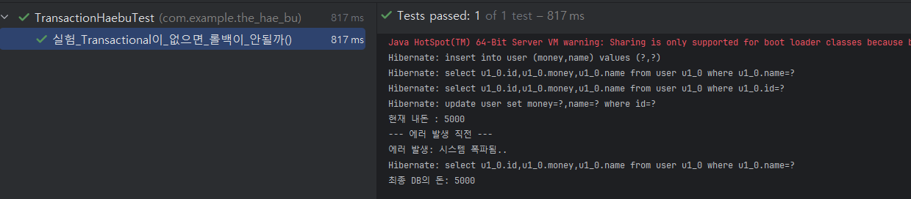

# 🔬 실험 01. @Transactional을 빼면 어떻게 될까?

> **"트랜잭션이 없으면 롤백만 안 되는 게 아니라, JPA가 일(Dirty Checking)을 안 한다."**

## 1. 실험 설계 (Hypothesis)
- **가설 1:** `@Transactional`이 없으면 비즈니스 로직 도중 예외가 발생해도 이미 실행된 DB 작업은 롤백되지 않을 것이다.
- **가설 2:** 트랜잭션 범위 밖에서는 JPA의 '변경 감지(Dirty Checking)'가 동작하지 않아, `save()`를 명시적으로 호출해야만 데이터가 수정될 것이다.

## 2. 실험 환경 (Infrastructure)
- **Target:** `HaebuService.java`
- **Method:** `택배_시키기(String name, int 보낼돈)`
- **Stack:** Spring Boot 3.4, JPA, MySQL 8.0 (Docker)

## 3. 집도 과정 (Step-by-Step)

### [Case A] @Transactional이 있을 때 (정석)
- `user.돈_보내기()` 호출 후 에러 발생 시, JPA가 전체 과정을 **Rollback**함.
- **결과:** 최종 DB의 돈은 **10,000원**으로 유지됨 (데이터 정합성 보호).

### [Case B] @Transactional 제거 (1차 조짐)
- `@Transactional`을 떼고 실행하자, 객체의 돈을 깎았음에도 **Update 쿼리가 아예 날아가지 않음.**
- **원인:** 트랜잭션이 없으면 영속성 컨텍스트가 변경 사항을 DB에 반영(Flush)할 기준점을 찾지 못함.

### [Case C] @Transactional 제거 + 수동 save() (대참사 발생)
- 트랜잭션 없이 수정을 반영하기 위해 `userRepository.save(user)`를 강제로 호출함.
- **결과:** `Update` 쿼리는 즉시 실행되었으나, 이후 에러가 발생했을 때 **롤백이 불가능하여 DB에 5,000원만 남음.**

---

## 4. 집도 증거 (Evidence)

| 구분 | 실행 로그 (Hibernate) | 최종 데이터 상태 |
| :--- | :--- | :--- |
| **정상** | `insert` -> `select` -> (Error) -> **Rollback** | 10,000원 (Safe) |
| **참사** | `insert` -> `select` -> `update` -> (Error) | **5,000원 (Danger!)** |

### 📸 실험 결과 스크린샷
>   
> *(수동으로 `save()`를 호출하여 `update` 쿼리가 박혔으나, 에러 발생 후 롤백되지 않아 5,000원이 남은 모습)*

---

## 5. 해부 결론 (Conclusion)

1. **원자성(Atomicity)의 파괴:** 트랜잭션이 없으면 'All or Nothing'이 보장되지 않는다. "결제는 성공했는데 주문 정보는 안 남는" 대참사가 실제 운영 환경에서 터질 수 있다.
2. **Dirty Checking의 전제 조건:** JPA의 변경 감지는 **트랜잭션이라는 엔진** 위에서만 돌아간다. 트랜잭션이 없으면 `save()`를 일일이 호출해야 하며, 이는 코드의 복잡도를 높이고 실수할 확률(롤백 불가)을 키운다.
3. **트랜잭션과 영속성 컨텍스트:** `@Transactional`이 붙으면 스프링은 프록시 객체를 생성하여 트랜잭션을 시작하고, 작업이 끝나면 영속성 컨텍스트를 `flush`하며 변경 사항을 DB에 밀어 넣는다. 이 메커니즘을 이해하지 못하면 JPA를 제대로 쓴다고 할 수 없다.

---

### 💡 오늘의 조짐 포인트
> "JPA는 똑똑하다. 하지만 트랜잭션이라는 울타리가 없으면, 자신이 관리하던 엔티티가 바뀌어도 그것을 DB에 전할 '책임'을 지지 않는다."